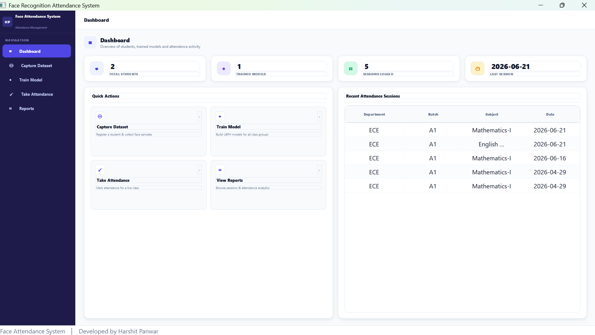
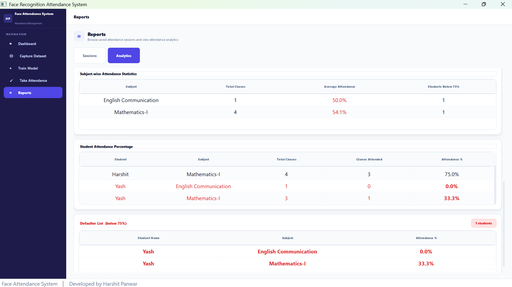

# 🎓 Face Recognition Attendance System

A desktop application that automates classroom attendance using real-time
face recognition — register students, train a model per class group, and
mark attendance by walking past a webcam.


**Developed by [Harshit Panwar](https://github.com/HarshitPanwar27)**

---

## 📑 Table of Contents

- [✨ Features](#-features)
- [📸 Screenshots](#-screenshots)
- [🗂️ Project Structure](#️-project-structure)
- [🧰 Tech Stack](#-tech-stack)
- [⚙️ One-Time Setup](#️-one-time-setup)
- [🖥️ How to Use the GUI](#️-how-to-use-the-gui)
- [📁 Attendance Folder Structure](#-attendance-folder-structure)
- [🏫 Batches](#-batches)
- [🛠️ Troubleshooting](#️-troubleshooting)
- [⚡ Quick Start Commands](#-quick-start-commands)
- [🧭 Roadmap](#-roadmap)
- [📄 License](#-license)

---

## ✨ Features

- 🖥️ **Modern desktop GUI** — sidebar navigation with a live Dashboard, built in PyQt5
- 📷 **Automated dataset capture** — Haar Cascade face detection, 100 samples per student
- 🧠 **Per-class-group training** — one LBPH recognition model per Department × Semester × Batch
- ✅ **Real-time attendance marking** — color-coded recognition feed (present / unknown / wrong class)
- 📊 **Reports & analytics** — session history, present/absent pie charts, CSV records
- 🗂️ **Organized by class** — Department → Semester → Batch structure throughout

---

## 📸 Screenshots


### Dashboard



### Analytics Dashboard


---

## 🗂️ Project Structure

```
face-recognition-attendance-system/
├── main.py                       # Run this — PyQt5 GUI (sidebar + Dashboard)
├── core.py                       # Backend logic: capture, train, attendance, CSV
├── courses.py                    # Course catalog — edit to add/change subjects
├── styles.py                     # Theme constants (palette, fonts, components)
├── 1_capture_dataset.py          # Standalone CLI: capture a student's face dataset
├── 2_train_model.py              # Standalone CLI: train LBPH models
├── 3_take_attendance.py          # Standalone CLI: run an attendance session
├── requirements.txt              # Python dependencies
├── student_registry.example.json # Sample registry format (no real data)
├── .gitignore
└── README.md

# Generated at runtime — gitignored, not in the repo:
├── dataset/        # captured face images, per student
├── trainer/        # trained .yml models, per class group
├── attendance/      # per-session CSV attendance records
└── student_registry.json
```

---

## 🧰 Tech Stack

| Layer | Technology |
|---|---|
| GUI | [PyQt5](https://pypi.org/project/PyQt5/) |
| Face detection | OpenCV Haar Cascade |
| Face recognition | OpenCV LBPH (`cv2.face.LBPHFaceRecognizer`) |
| Charts | Matplotlib |
| Data | JSON (registry) + CSV (attendance records) |

---

## ⚙️ One-Time Setup

### 1. Install Python 3.8+
Download from https://python.org — check **"Add Python to PATH"**

### 2. Install all dependencies
```
pip install PyQt5 opencv-contrib-python numpy matplotlib
```

> **Important:** Use `opencv-contrib-python`, NOT `opencv-python`.
> If you already have `opencv-python`:
> ```
> pip uninstall opencv-python
> pip install opencv-contrib-python
> ```

### 3. Verify
```
python -c "import PyQt5, cv2, numpy, matplotlib; print('All OK'); print(cv2.face)"
```
Should print `All OK` and `<module 'cv2.face'>` with no errors.

### 4. Run
```
python main.py
```

---

## 🖥️ How to Use the GUI

The app opens with a **left sidebar** for navigation and a **Dashboard** as
the landing page. Click any sidebar item to switch pages — your place in
the workflow is always shown by the highlighted nav item.

### 🏠 Dashboard
The landing page. Shows at a glance:
- Total registered students, trained class groups, and attendance sessions
- A "Sessions Today" counter
- A table of the most recent attendance sessions
- A department breakdown chart
- Quick-action buttons that jump straight to Capture / Train / Attendance / Reports

### 📷 Capture Dataset
Register each student and capture their face images.

**Fill in:**
- Student ID (unique number per student, e.g. 1–10)
- Full Name
- Department: `ECE` or `CSE`
- Semester: 1–8
- Batch:
  - ECE → `A1`, `A2`, or `A3`
  - CSE → `B1`, `B2`, or `B3`

Click **Start Capture** → webcam opens → student looks at camera → 100 photos captured automatically.

Repeat for every student in the batch.

### 🧠 Train Model
Click **Start Training** after all students are captured.

- Trains one LBPH model per class group (Dept × Semester × Batch)
- Live training log shown on screen
- Re-run anytime a new student is added

### ✅ Take Attendance
Run this at the start of every class.

1. Select Department, Semester, Batch
2. Select Subject from the dropdown (auto-populated from course catalog)
3. Click **Start Session**
4. Students walk past the webcam one by one

**What appears on screen:**

| Box Colour | Meaning |
|---|---|
| 🟢 Green | Student recognised — MARKED PRESENT |
| Dark green | Student already marked this session |
| 🟠 Orange | Student from wrong class — NOT ENROLLED |
| 🔴 Red | Face not recognised — Unknown |

Click **End Session & Save** when done.

### 📊 Reports
View all past sessions with:
- Full attendance table (Present / Absent per student)
- Pie chart showing present vs absent breakdown
- Filter by Department and Batch

---

## 📁 Attendance Folder Structure

```
attendance/
└── ECE/
    └── A1/
        └── VLSI_Design/
            └── 2026-04-25_09-15-00.csv
└── CSE/
    └── B2/
        └── Cloud_Computing/
            └── 2026-04-25_10-00-00.csv
```

Each CSV contains every student in the batch:
- Present students → time of recognition
- Absent students → `--:--:--`

---

## 🏫 Batches

| Department | Batches |
|---|---|
| ECE | A1, A2, A3 |
| CSE | B1, B2, B3 |

---

## 🛠️ Troubleshooting

| Problem | Fix |
|---|---|
| `No module named PyQt5` | `pip install PyQt5` |
| `No module named cv2.face` | `pip install opencv-contrib-python` |
| Webcam not opening | Check Windows Settings → Privacy → Camera |
| Too many Unknown detections | Raise `CONFIDENCE_THRESHOLD` in `core.py` (try 75) |
| Wrong students recognised | Lower `CONFIDENCE_THRESHOLD` in `core.py` (try 55) |
| No subjects in dropdown | Check `courses.py` for that dept/semester |
| Model not found error | Run the Train Model page first |
| Black window on startup | Update graphics drivers or try `app.setStyle("Windows")` in `main.py` |

---

## ⚡ Quick Start Commands

```bash
# Install everything
pip install PyQt5 opencv-contrib-python numpy matplotlib

# Launch the application
python main.py
```

---

## 🧭 Roadmap

Ideas for future iterations — not yet implemented:

- [ ] Export attendance reports to PDF
- [ ] Switch to a deep-learning face embedding model (e.g. FaceNet/dlib) for higher accuracy
- [ ] Multi-camera support for larger classrooms
- [ ] Email/SMS notification for low-attendance students

---

## 📄 License

See [`LICENSE`](LICENSE) for details.

---

<div align="center">

**Built by [Harshit Panwar](https://github.com/HarshitPanwar27)**

</div>